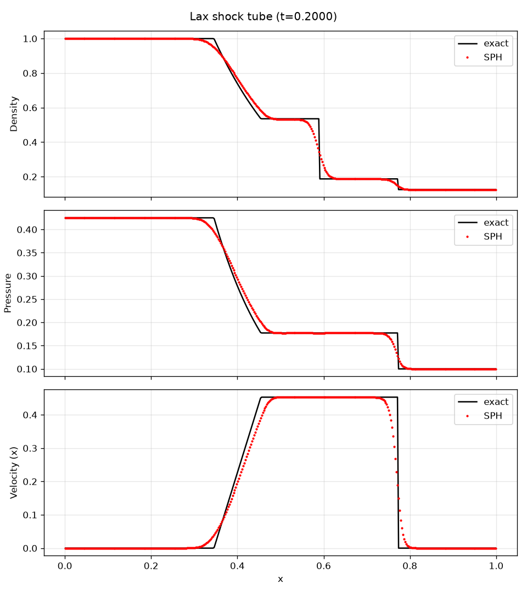
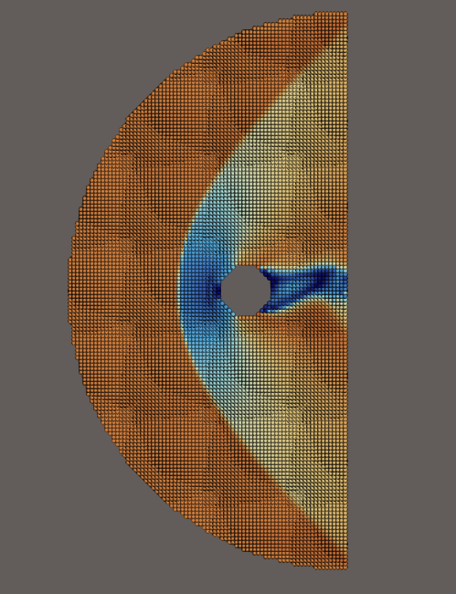
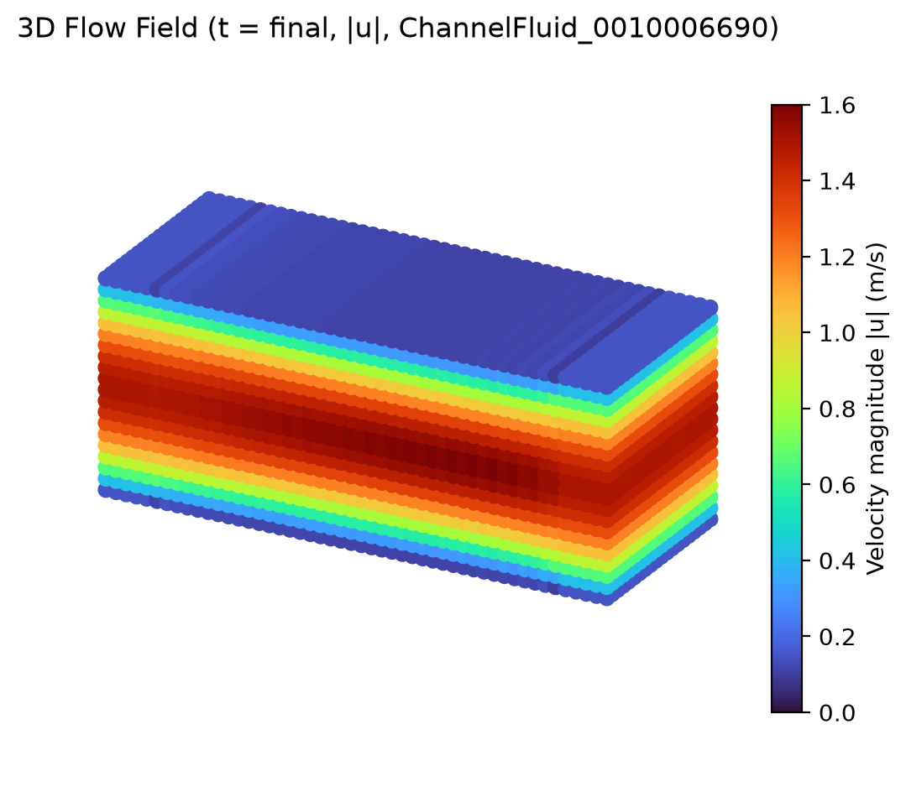
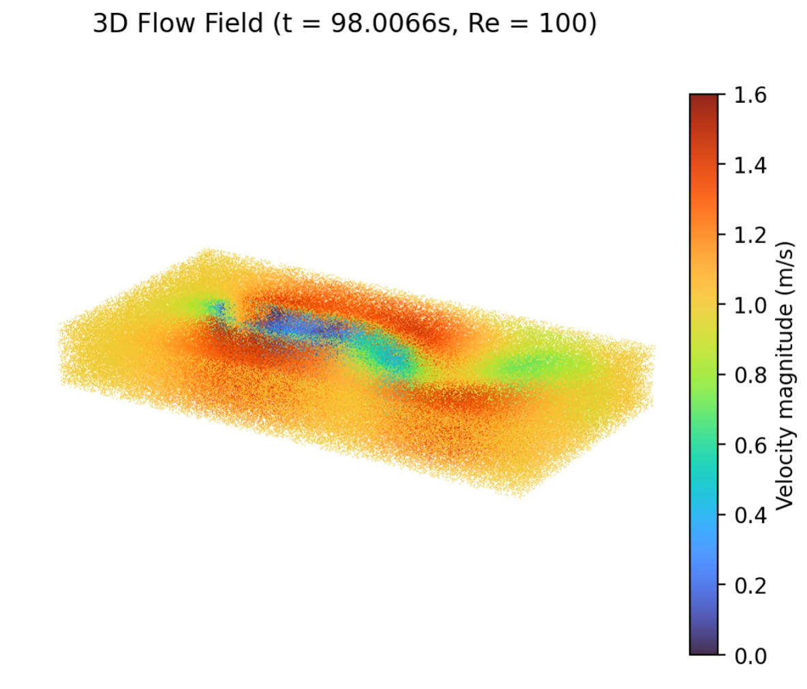
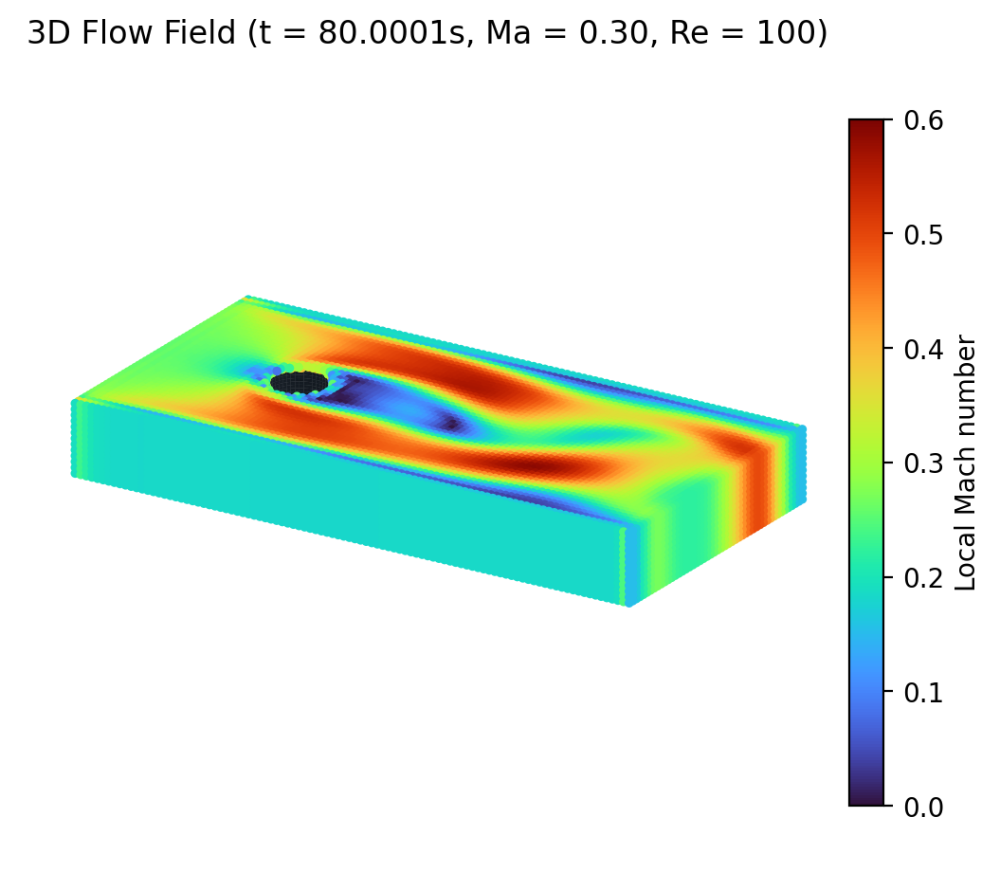

# eulerian-SPH

基于 [SPHinXsys](https://github.com/Xiangyu-Hu/SPHinXsys) 框架的欧拉 SPH 求解器，覆盖 2D 与 3D 弱可压缩与可压缩流动验证算例。

## 项目简介

`eulerian-SPH` 是 SPHinXsys 上游（`my_SPHinXsys`）的欧拉 SPH 专用分支。与一般 Lagrangian SPH 不同，欧拉 SPH 以 Euler 视角在背景网格上更新守恒量，粒子在场内随流体输运，并借鉴有限体积法的 Riemann 解（HLLC + MUSCL 重构）处理对流项，从而：

- 在大变形、强间断（如激波）下保持稳定；
- 直接输出密度、压力、速度等守恒量，便于与网格参考解对照；
- 同一框架下覆盖弱可压缩（low-Mach，主要用于圆柱绕流与 3D 通道）、可压缩粘性（如 3D 可压缩圆柱）与可压缩无粘（如超声速圆柱、激波管）等不同流体模型。

本仓库聚焦于欧拉 SPH 相关算例与代码，包含：

- **基础算例**：Taylor–Green 涡（粘性可压缩）、圆柱绕流（Re=100 弱可压缩 / 可压缩 / 超声速 Ma=2）、Lax 激波管；
- **3D 算例**：3D 欧拉通道、3D 弱可压缩 / 可压缩圆柱绕流。
- 未跑通或不在本 README 配图范围内的算例（参见 `tests/`）：见下方算例说明表。

代码层面，按算例差异选用不同核函数与修正策略：2D Taylor–Green 涡与 2D 超声速圆柱绕流显式使用 Laguerre–Gauss 核 + 线性梯度修正；2D / 3D 圆柱绕流使用默认核 + 线性梯度修正矩阵；Lax 激波管采用默认核 + `NoKernelCorrection`（关掉流体–壁面 contact 的核修正），以抑制接触附近的奇偶振荡。

## 计算结果展示

### 2D 算例

**Lax 激波管（`test_2d_eulerian_shock_tube_LG`）**  
密度 / 压力 / 速度沿 x 方向与精确解（Riemann 解）对比，t=0.2：



可看到 SPH 解在激波、接触间断、稀疏波三段都能跟踪精确解，壁面附近无系统性跳变。

**超声速圆柱绕流（`test_2d_eulerian_supersonic_flow_new_BC`，Ma=2）**  
弓形激波结构清晰可辨：



### 3D 算例

**3D 欧拉通道（`test_3d_eulerian_channel`）**  
弱可压缩 + 周期性 + 壁面边界，最终时刻速度大小云图，剖面呈抛物线分布：



**3D 弱可压缩圆柱绕流（`test_3d_eulerian_flow_around_cylinder_LG`，Re=100）**  
绕流后 Mach 数云图，可见卡门涡街：



**3D 可压缩圆柱绕流（`test_3d_eulerian_compressible_flow_around_cylinder_LG`，Re=100）**  
可压缩模型下的速度大小云图，能看到前驻点 + 后侧回流区：



> 完整结果输出在 `tests/<case>/output/` 下，VTP 格式可用 [ParaView](https://www.paraview.org) 打开。

## 算例说明

### 2D 算例

| 算例 | 物理问题 | 流体模型 | 边界条件 |
|------|----------|----------|----------|
| `test_2d_eulerian_taylor_green_LG` | Taylor–Green 涡，Re=100 | 可压缩 + 粘性 | 全周期 |
| `test_2d_eulerian_flow_around_cylinder_LG` | 圆柱绕流，Re=100 | 弱可压缩 + 粘性 | 非反射远场 |
| `test_2d_eulerian_supersonic_flow_new_BC` | 超声速圆柱绕流，Ma=2 | 可压缩（无粘）| 反射壁（ghost）+ 远场 |
| `test_2d_eulerian_shock_tube_LG` | Lax 激波管 | 可压缩 + Riemann | x 反射壁 + y 周期 |

### 3D 算例

| 算例 | 物理问题 | 流体模型 | 边界条件 |
|------|----------|----------|----------|
| `test_3d_eulerian_channel` | 欧拉通道流 | 弱可压缩 | 周期性 + 壁面 |
| `test_3d_eulerian_flow_around_cylinder_LG` | 3D 圆柱绕流，Re=100 | 弱可压缩 + 粘性 | 非反射远场 + z 周期 |
| `test_3d_eulerian_compressible_flow_around_cylinder_LG` | 3D 可压缩圆柱绕流 | 可压缩 + 粘性 | 远场（ghost + 周期混合） |

## 目录结构

```
eulerian-SPH/
├── CMakeLists.txt
├── docs/                       # 算例结果展示图（本 README 引用）
├── src/
│   ├── shared/                 # SPHinXsys 共享核心库
│   ├── for_2D_build/           # 2D 构建专属
│   ├── for_3D_build/           # 3D 构建专属（SDF / STL / 极分解等）
│   └── 3rd_party/              # 内嵌 tinyxml2
└── tests/
```

> **说明**：相对上游 `my_SPHinXsys`，本项目显式剔除了 Cell-linked List 加速后端（`shared_ck`），CMake 在 `src/shared/` 下做了 glob 防护，避免未来上游同步再次引入；Simbody 部分保留 `SimTK::SpatialVec` 等用于 FSI 与 3D 几何。

---
### 系统包管理器安装
# Ubuntu / Debian
sudo apt install cmake g++ libeigen3-dev libtbb-dev libboost-dev libboost-program-options-dev libboost-geometry-dev libspdlog-dev libfmt-dev libsimbody-dev libgtest-dev

# CentOS / RHEL
sudo dnf install cmake gcc-c++ eigen3-devel tbb-devel boost-devel boost-program-options boost-geometry spdlog-devel fmt-devel simbody-devel gtest-devel

### Docker 快速开始

如果希望在一台新的 Linux 电脑上快速部署本项目，同时避免宿主机依赖冲突，推荐使用 Docker 作为"依赖环境容器"。本项目代码保存在宿主机本地目录，Docker 只负责提供隔离好的编译和运行依赖；后续修改本地代码后，可以直接在容器内重新编译运行，无需重新安装宿主机依赖。

#### 1. 安装 Docker（Linux）

如果新机器还没有 Docker，请先按照 Docker 官方文档安装 Docker Engine。

**Ubuntu / Debian：**

```bash
sudo apt-get update
sudo apt-get install -y ca-certificates curl
sudo install -m 0755 -d /etc/apt/keyrings
sudo curl -fsSL https://download.docker.com/linux/ubuntu/gpg -o /etc/apt/keyrings/docker.asc
sudo chmod a+r /etc/apt/keyrings/docker.asc

echo \
  "deb [arch=$(dpkg --print-architecture) signed-by=/etc/apt/keyrings/docker.asc] https://download.docker.com/linux/ubuntu \
  $(. /etc/os-release && echo "${UBUNTU_CODENAME:-$VERSION_CODENAME}") stable" | \
  sudo tee /etc/apt/sources.list.d/docker.list > /dev/null

sudo apt-get update
sudo apt-get install -y docker-ce docker-ce-cli containerd.io docker-buildx-plugin docker-compose-plugin
sudo systemctl enable --now docker
sudo docker run hello-world
```

如果是 Debian，请将上面仓库地址中的 `ubuntu` 替换为 `debian`。

**CentOS / RHEL 系：**

```bash
sudo dnf -y install dnf-plugins-core
sudo dnf config-manager --add-repo https://download.docker.com/linux/centos/docker-ce.repo
sudo dnf install -y docker-ce docker-ce-cli containerd.io docker-buildx-plugin docker-compose-plugin
sudo systemctl enable --now docker
sudo docker run hello-world
```

如果希望当前用户不加 `sudo` 直接运行 Docker，可参考 [Docker 官方后置步骤](https://docs.docker.com/engine/install/linux-postinstall/)。

#### 2. 删除旧目录并重新克隆仓库

```bash
mkdir -p /home/DataBank/SPH_solver
cd /home/DataBank/SPH_solver
rm -rf /home/DataBank/SPH_solver/eulerian-SPH
git clone https://github.com/KIYOYOZU/eulerian-SPH eulerian-SPH
cd /home/DataBank/SPH_solver/eulerian-SPH
```

#### 3. 构建 Docker 镜像

```bash
docker build -t eulerian-sph:latest .
```

镜像构建完成后，容器内具备以下依赖：`cmake`、`g++ / build-essential`、`Eigen3`、`TBB`、`Boost::geometry`、`Boost::program_options`、`Ninja`。

#### 4. 启动开发容器

把宿主机仓库整体挂载进容器，构建产物和输出会直接落在本地仓库中，本地改代码后能立即重新编译。

```bash
cd /home/DataBank/SPH_solver/eulerian-SPH

docker run --rm -it \
  -v "$PWD":/workspace \
  -e ROOT_DIR=/workspace \
  -e BUILD_DIR=/workspace/build \
  --entrypoint bash \
  eulerian-sph:latest
```

容器内项目根目录对应为 `/workspace`。

#### 5. 常用环境变量

| 变量 | 默认值 | 说明 |
|------|--------|------|
| `ROOT_DIR` | `/opt/eulerian-SPH` | 项目根目录，可改成挂载进去的源码目录 |
| `BUILD_DIR` | `$ROOT_DIR/build` | Docker 内使用的构建目录 |
| `BUILD_TYPE` | `Release` | CMake 构建类型 |
| `BUILD_JOBS` | `nproc` | 并行编译线程数 |
| `FORCE_CONFIGURE` | `0` | 设为 `1` 时强制重新执行 CMake 配置 |
| `CONFIGURE_ONLY` | `0` | 设为 `1` 时只配置不编译、不运行 |
| `SKIP_BUILD` | `0` | 设为 `1` 时跳过编译，仅运行已有二进制 |
| `RUN_ARGS` | 空 | 用环境变量传递简单运行参数 |

---

> **注意**：以上路径以 Linux + Ninja 单配置为例；二进制直接在 `bin/` 下。Windows + MSVC 多配置生成器需要在 `bin/` 后再加 `Release/`（或 `Debug/`）子目录。

结果写入 `output/`（VTP 格式），可用 [ParaView](https://www.paraview.org) 打开。